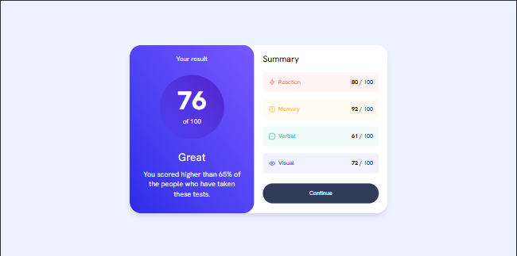
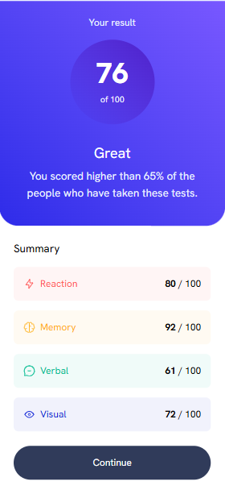

# Frontend Mentor - Results Summary Component

This is a solution to the [Results Summary Component challenge on Frontend Mentor](https://www.frontendmentor.io/challenges/results-summary-component-CE_K6s0maV). Frontend Mentor challenges help you improve your front-end skills by building realistic projects based on professional designs.

## Table of contents

- [Overview](#overview)
  - [The challenge](#the-challenge)
  - [Screenshot](#screenshot)
  - [Links](#links)
- [My process](#my-process)
  - [Built with](#built-with)
  - [What I learned](#what-i-learned)
  - [Continued development](#continued-development)
  - [Useful resources](#useful-resources)
- [Author](#author)
- [Getting Started with This Project](#getting-started-with-this-project)

## Overview

### The challenge

Users should be able to:

- View the optimal layout for the interface depending on their device's screen size
- See hover and focus states for all interactive elements on the page
- **Bonus**: Use the local JSON data to dynamically populate the content

### Screenshot

#### Desktop View



#### Mobile View



### Links

- Live Site URL: [Live Demo](https://fm-result-summary-component-nine.vercel.app/)
- Solution URL: [GitHub Repo](https://github.com/SultanFarrel/fm-result-summary-component)

## My process

### Built with

- Semantic HTML5
- [React JS](https://reactjs.org/)
- [Tailwind CSS](https://tailwindcss.com/)
- [Vite](https://vitejs.dev/) as the build tool
- Mobile-first workflow
- Frontend Mentor starter template design

### What I learned

One of the main challenges was creating a responsive component while also ensuring that it was built efficiently and without unnecessary repetition. This helped me improve my ability to break down UI into reusable, maintainable components.

I also learned how to build responsive components using Tailwind CSS and practiced applying atomic design principles in React to structure components effectively.

### Continued development

In the future, I plan to rebuild this project using more modern React tools such as Context API, Redux, and Redux Toolkit. This will allow me to explore state management in larger applications and apply best practices for organizing scalable React projects.

### Useful resources

- [Tailwind CSS Documentation](https://tailwindcss.com/)
- [Vite Documentation](https://vite.dev/guide/)

## Author

- Website - [Sultan Farrel](https://www.sultanf.my.id/)
- Frontend Mentor - [@SultanFarrel](https://www.frontendmentor.io/profile/SultanFarrel)
- GitHub - [@SultanFarrel](https://github.com/SultanFarrel)

## Getting Started with This Project

To run this project locally, follow these steps:

### 1. Clone the repository

```bash
git clone https://github.com/SultanFarrel/fm-result-summary-component.git
cd fm-result-summary-component
```

### 2. Install the dependencies

Make sure you have Node.js installed (preferably the latest LTS version). Then, install dependencies using your preferred package manager:

#### Using npm

```bash
npm install
```

#### Or using yarn

```bash
yarn
```

#### Or using pnpm

```bash
pnpm install
```

### 3. Run the development server

#### Using npm

```bash
npm run dev
```

#### Or using yarn

```bash
yarn dev
```

#### Or using pnpm

```bash
pnpm dev
```

The app will be available at http://localhost:5173/ by default.
